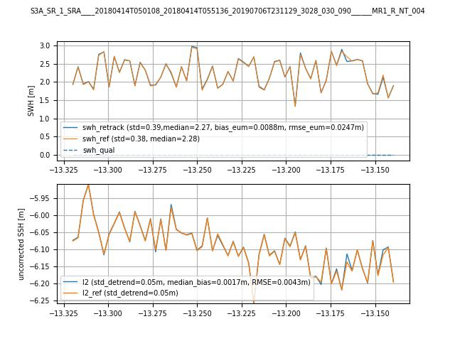

[//]: # (![pysamosa logo]&#40;./resources/logo.jpg&#41;)

 <div align="center"></div>


[](https://app.travis-ci.com/floschl/pysamosa)
[](https://www.gnu.org/licenses/gpl-3.0)

# PySAMOSA

This framework provides a Python implementation for retracking open ocean and coastal waveforms from SAR satellite
altimetry, which are based on the open ocean power return echo waveform model SAMOSA2 [1].

The following satellite altimetry missions are supported and validated:
- Sentinel-3 (S3)
- Sentinel-6 Michael Freilich (S6-MF)

The software retracks Level-1b (L1b) data, i.e. the power return echo waveforms and outputs the retracked variables
SWH, range, and Pu.

The following SAMOSA2 implementations are used:
- S3A/S3B: [1]
- S6-MF: [2]

For retracking coastal waveforms the following retrackers can be used:
- SAMOSA+ [3]
- CORAL [4,5]

In addition, FF-SAR-processed S6-MF can be retracked using the zero-Doppler of SAMOSA2 and a specially adapted
$\alpha_p$ LUT table, as been used in [5] and created by the ESA L2 GPP project [7].

Not validated (experimental) features:
- Windows support
- CryoSat-2 (CS2) support
- SAMOSA++ coastal retracker [2]
- Retracking of sigma_0 ('wind speed')

## Prerequisites

### Linux

Optional: Install miniconda

    $ wget https://repo.anaconda.com/miniconda/Miniconda3-latest-Linux-x86_64.sh
    $ bash Miniconda3-latest-Linux-x86_64.sh

### Windows

Linux is the recommended operation system (OS), however, Windows should work as well.

- A Windows C/C++ compiler may be required for installation, e.g. MSCV, which comes with the free [Visual Studio Community](https://visualstudio.microsoft.com/vs/community/)
- Optional: Download and install Miniconda from [here](https://repo.anaconda.com/miniconda/Miniconda3-latest-Windows-x86_64.exe).


### IDE

It is highly recommended to use a proper Python IDE, such as PyCharm, which is [free](https://www.jetbrains.com/pycharm/download/) for non-commercial projects.
Using the IDE will allow you to familiarise yourself better with the code and debug it.

## Getting-started

Clone this repo

    $ git clone {repo_url}

Enter clones directory

    $ cd pysamosa

Create your Python environment
either via conda

    $ conda create -n pysamosa --file requirements.txt -c default -c conda-forge python=3.11

or via pipenv/venv.

Activate pysamosa conda environment

    $ conda activate pysamosa

Download auxiliary data: distance-to-coast grid file (required), approx. download size 310 MB, test sample files
(optional), download size approx. 200 MB

    $ python -m pysamosa.download_aux_data

Compile the .pyx files (e.g. model_helpers.pyx) by running cython

    $ python setup.py build_ext --inplace

Optional: Compile on an HPC cluster (not normally required)

    $ LDSHARED="icc -shared" CC=icc python setup.py build_ext --inplace

## Some hints

The following list provides a brief description of the recommended use of the software.
1. **Getting-started with Jupyter Notebook**
The `notebooks/retracking_example.ipynb` contains a sample script how to retrack a sample EUMETSAT baseline L1b file.
The retracked SWH and SWH data are compared with the EUMETSAT baseline L2 data.

2. **More entry points**
The files `main_s3.py`, `main_s6.py`, `main_cs.py`, (`main_*.py`) etc. serve as entry points for batch processing of multiple nc files.
3. **Settings**
The `RetrackerProcessor` inputs require the `RetrackerProcessorSettings`, `RetrackerSettings`, `FittingSettings`,
   `WaveformSettings`, and `SensorSettings` objects to be inserted during initialisation. The default settings of these settings objects can be retrieved with the `get_default_base_settings` function based on the three
   settings `L1bSourceType`, `RetrackerBaseType`, and `SettingsPreset`.
   For instance, the following code snippet is taken from the `main_s3.py` file and retracks Sentinel-3 data with the default SAMOSA-based open ocean retracker with no SettingsPreset (100 waveforms from measurement index 25800,
   and using 6 cores).
```python
    l1b_src_type = L1bSourceType.EUM_S3
    rbt = RetrackerBaseType.SAM
    pres = SettingsPreset.NONE
    rp_sets, retrack_sets, fitting_sets, wf_sets, sensor_sets = get_default_base_settings(retracker_basetype=rbt, settings_preset=pres, l1b_src_type=l1b_src_type)

    rp_sets.nc_dest_dir = nc_dest_path / run_name
    rp_sets.n_offset = 25800
    rp_sets.n_inds = 100
    rp_sets.n_procs = 6
    rp_sets.skip_if_exists = False
```
Another configuration to run SAM+ could be set by `rbt = RetrackerBaseType.SAMPLUS`.

4. **Evaluation environment**
There are several unit tests located in `./pysamosa/tests/` that aim to analyse the retracked output in more detail.
The most important test scripts are `test_multi_retrack.py`, which includes retracking runs of small along-track
segments of the S3A, S6, CS2 missions (and a generic input nc file).
`test_single_retrack` allows you to check the retracking result of a single waveform and compare it to reference retracking result.

<span style="color:red; font-weight:bold">Please uncomment the line `mpl.use('TkAgg')` in file `conftest.py` to
plot the test output, which is particularly useful for the retracking tests in files `tests/test_single_retrack.
py` and `tests/test_multi_retrack.py`.</span>

## Run tests

To run all the unit tests (using the pytest framework), run

    $ pytest

## Comparison with EUMETSAT L2 baseline data

Comparison of a retracked open ocean segment from S3 and S6-MF with the EUMETSAT L2 baseline (S3: 004, S6-MF: F06)
(generated by `notebooks/retracking_example.ipynb` Jupyter notebook)

S3 | S6-MF
:-:|:-:
  |  

## Contributions

Feel free to contribute to this project.
- Fork this repository
- Submit a pull request to be merged back into this repository.

## Future work

Possible developments of this project are:

Retracking-related
- Numerical retracking planned for Q3/2023 in the EUMETSAT's baseline processing chain [6]
- Aligning CS-2 retracking with the CS-2 baseline processing chain

Software-related
- Create richer documentation (readthedocs)

## Credits and code reuse

This software is licenced under [GPLv3](https://www.gnu.org/licenses/gpl-3.0.en.html). In short, you are allowed to use
this software in your projects, if you change parts of the code you are required to also publish it. For more
frequently asked questions about GPL, please see [here](https://www.gnu.org/licenses/gpl-faq.html).

If you use this code, please cite this DOI:

Florian Schlembach; Marcello Passaro. Pysamosa: An Open-source Software Framework for Retracking Samosa-based, Open
Ocean and Coastal Waveforms of SAR Satellite Altimetry. Zenodo. https://zenodo.org/badge/latestdoi/646028227.

This package was created with [Cookiecutter](https://github.com/audreyr/cookiecutter) and the
[audreyr/cookiecutter-pypackage](https://github.com/audreyr/cookiecutter-pypackage) project template.

## References

[1] SAMOSA Detailed Processing Model: Christine Gommenginger, Cristina Martin-Puig, Meric Srokosz, Marco Caparrini, Salvatore Dinardo, Bruno Lucas, Marco Restano, Américo, Ambrózio and Jérôme Benveniste, Detailed Processing Model of the Sentinel-3 SRAL SAR altimeter ocean waveform retracker, Version 2.5.2, 31 October 2017, Under ESA-ESRIN Contract No. 20698/07/I-LG (SAMOSA), Restricted access as defined in the Contract,  Jérôme Benveniste (Jerome.Benvensite@esa.int) pers. comm.

[2] EUMETSAT. Sentinel-6/Jason-CS ALT Level 2 Product Generation Specification (L2 ALT PGS), Version V4D; 2022.
https://www.eumetsat.int/media/48266.

[3] Dinardo, Salvatore. ‘Techniques and Applications for Satellite SAR Altimetry over Water, Land and Ice’.
Dissertation, Technische Universität, 2020. https://tuprints.ulb.tu-darmstadt.de/11343/.

[4] Schlembach, F.; Passaro, M.; Dettmering, D.; Bidlot, J.; Seitz, F. Interference-Sensitive Coastal SAR Altimetry
Retracking Strategy for Measuring Significant Wave Height. Remote Sensing of Environment 2022, 274, 112968. https://doi.org/10.1016/j.rse.2022.112968.

[5] Schlembach, F.; Ehlers, F.; Kleinherenbrink, M.; Passaro, M.; Dettmering, D.; Seitz, F.; Slobbe, C. Benefits of Fully Focused SAR Altimetry to Coastal Wave Height Estimates: A Case Study in the North Sea. Remote Sensing of Environment 2023, 289, 113517. https://doi.org/10.1016/j.rse.2023.113517.

[6] Scharroo, R.; Martin-Puig, C.; Meloni, M.; Nogueira Loddo, C.; Grant, M.; Lucas, B. Sentinel-6 Products Status. Ocean Surface Topography Science Team (OSTST) meeting in Venice 2022. https://doi.org/10.24400/527896/a03-2022.3671.

[7] ESA L2 GPP Project: FF-SAR SAMOSA LUT generation was funded under ESA contract 4000118128/16/NL/AI.
